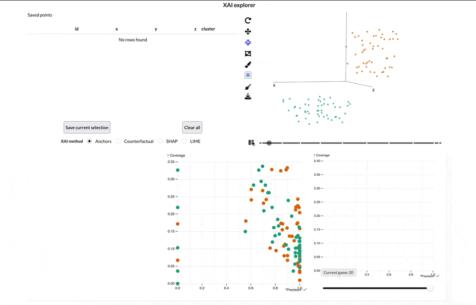

<!-- README.md is generated from README.Rmd. Please edit that file -->

```{r, include = FALSE}
knitr::opts_chunk$set(
  collapse = TRUE,
  comment = "#>",
  fig.path = "man/figures/README-",
  out.width = "100%"
)
```

# rosella 

<!-- badges: start -->
<!-- badges: end -->

Rosella helps you to view the data and ask questions about a machine learning model together in the same space.

## Installation

You can install the development version of rosella like so:

``` r
pak::pkg_install("janithwanni/rosella")
```

At the moment Rosella can show a proof of concept shiny application which will be extensible to your own data and model in the future releases.

